# Day 04 — Cisco IOS CLI & Basic Device Security

> **CCNA 200-301 Journey — Day 04**
>
> Focus: Cisco IOS CLI navigation, device naming, privileged EXEC protection, password encryption, configuration files, and saving configurations.

---

## 1. Day 04 Objectives

By the end of this lab, I should be able to:

- Understand the main Cisco IOS CLI modes.
- Move between User EXEC, Privileged EXEC, and Global Configuration mode.
- Use Cisco IOS context-sensitive help and command shortcuts.
- Configure a router and switch hostname.
- Configure an `enable password`.
- Understand why `enable password` is insecure.
- Enable `service password-encryption`.
- Understand Cisco Type 7 password obfuscation.
- Configure an `enable secret`.
- Understand why `enable secret` takes priority over `enable password`.
- View the active configuration with `show running-config`.
- View the saved configuration with `show startup-config`.
- Save the running configuration to NVRAM.
- Understand the difference between running-config and startup-config.
- Practice the complete configuration sequence repeatedly.

---

# 2. Cisco IOS and the CLI

## What is Cisco IOS?

**Cisco IOS (Internetwork Operating System)** is the operating system used by many Cisco networking devices, including:

- Routers
- Switches
- Firewalls and other Cisco network platforms

The Cisco IOS CLI provides a text-based method of configuring and managing network devices.

### CLI vs GUI

**CLI** = Command-Line Interface

Network engineers commonly use the CLI because it provides:

- Precise configuration control
- Fast configuration
- Powerful troubleshooting commands
- Automation-friendly workflows
- Consistent commands across many devices

---

# 3. Connecting to a Cisco Device

A Cisco device can be accessed through its **console port** for initial configuration.

### Console connection

Traditional console access may use:

- Cisco rollover/console cable
- RJ45 console connection
- Serial/DB9 connection on older equipment
- USB-to-serial adapter when required

Modern Cisco devices may also provide a **USB console port**.

> **Important:** An Ethernet crossover cable is not the cable used to connect to the RJ45 console port.

## Rollover Cable

A Cisco rollover cable reverses the pin order from one end to the other.

Example concept:

```text
Pin 1 → Pin 8
Pin 2 → Pin 7
Pin 3 → Pin 6
Pin 4 → Pin 5
Pin 5 → Pin 4
Pin 6 → Pin 3
Pin 7 → Pin 2
Pin 8 → Pin 1
```

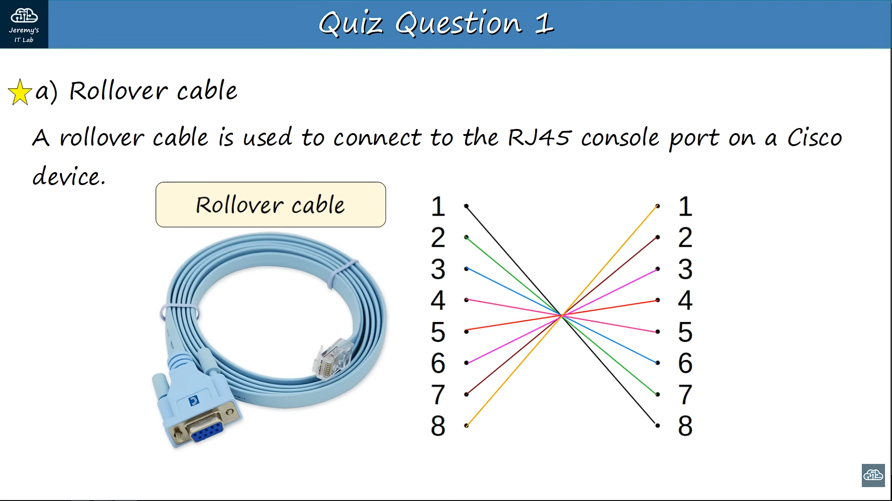

---

# 4. Terminal Emulator — PuTTY

A terminal emulator can be used to access the Cisco CLI.

A common console configuration is:

| Setting | Value |
|---|---:|
| Speed / Baud rate | `9600` bps |
| Data bits | `8` |
| Stop bits | `1` |
| Parity | `None` |
| Flow control | `None` |

These settings normally match the default console settings on Cisco devices.

---

# 5. Cisco IOS CLI Modes

Cisco IOS uses different command modes.

## Mode Overview

| Mode | Prompt | Purpose |
|---|---|---|
| User EXEC | `Router>` | Basic monitoring and limited commands |
| Privileged EXEC | `Router#` | Full EXEC-level access and verification |
| Global Configuration | `Router(config)#` | Configure the device |

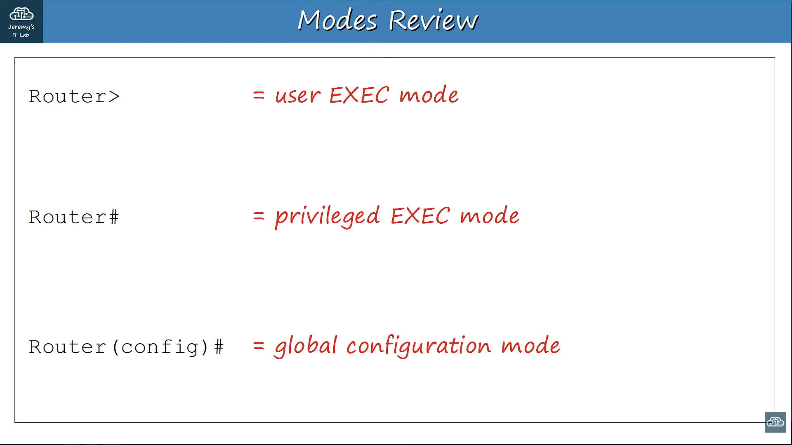

---

## 5.1 User EXEC Mode

Prompt:

```text
Router>
```

User EXEC is normally the first mode entered after connecting to the device.

It provides limited access.

Example:

```text
Router>
```

At this level, configuration changes cannot normally be made.

---

## 5.2 Privileged EXEC Mode

Enter:

```text
enable
```

Prompt changes from:

```text
Router>
```

to:

```text
Router#
```

Privileged EXEC provides access to powerful commands such as:

```text
show running-config
show startup-config
copy running-config startup-config
reload
```

### Remember

```text
Router>   = User EXEC
Router#   = Privileged EXEC
```

The `#` is an important visual indicator.

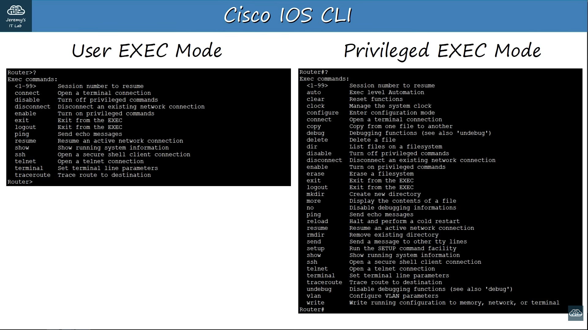

---

## 5.3 Global Configuration Mode

From Privileged EXEC:

```text
configure terminal
```

Shortcut:

```text
conf t
```

Prompt:

```text
Router(config)#
```

This is where global device configuration is performed.

### Full command

```text
configure terminal
```

### Common shortcut

```text
conf t
```

> **Study habit:** Know the full command even if you normally use the shortcut.

---

# 6. Cisco IOS Command Help and Shortcuts

Cisco IOS provides context-sensitive help using:

```text
?
```

Example:

```text
Router(config)# enable ?
```

The device displays the available options.

Cisco IOS also supports command abbreviation when enough characters uniquely identify the command.

Example:

```text
conf t
```

instead of:

```text
configure terminal
```

### Tab completion

Press:

```text
<Tab>
```

to automatically complete a command when the abbreviation is unambiguous.

### Useful habit

When learning:

1. Learn the complete command.
2. Understand what it does.
3. Then learn the common shortcut.

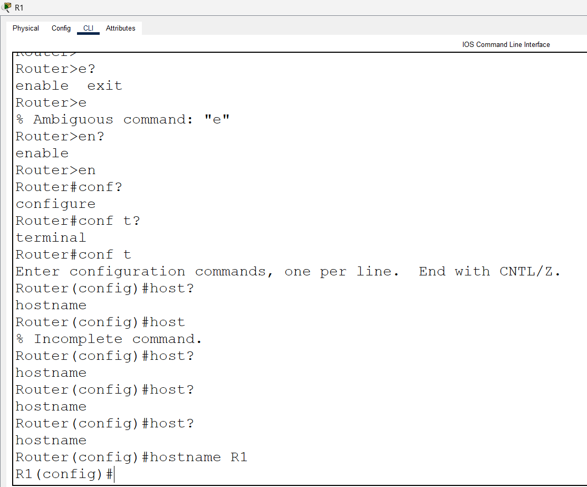

---

# 7. Day 04 Lab Topology

The basic lab contains:

```text
        Router R1
            |
            |
        Switch SW1
       /     |     \
     PC1    PC2    PC3
```

The purpose of the lab is not complicated routing yet.

The focus is on:

- CLI navigation
- Device naming
- Privileged EXEC security
- Password handling
- Configuration verification
- Configuration persistence

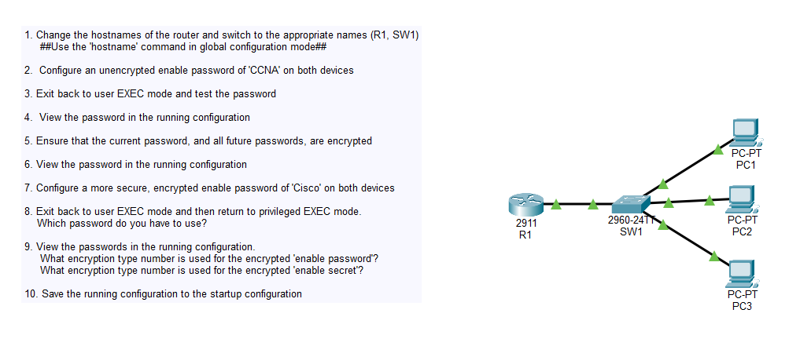

---

# 8. Step 1 — Configure the Router Hostname

Enter Privileged EXEC:

```text
enable
```

Enter Global Configuration:

```text
configure terminal
```

Set the hostname:

```text
hostname R1
```

The prompt changes from something similar to:

```text
Router(config)#
```

to:

```text
R1(config)#
```

### Why configure a hostname?

A hostname makes it easier to identify which device I am configuring.

In a real network with many devices, meaningful names are essential.


---

# 9. Step 2 — Configure the Switch Hostname

The same concept can be practiced on the switch.

Enter:

```text
enable
configure terminal
```

Then:

```text
hostname SW1
```

The prompt becomes:

```text
SW1(config)#
```

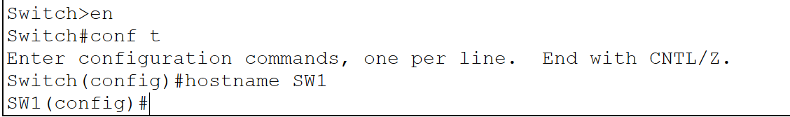

> **Practice:** Configure both `R1` and `SW1`, even when the demonstration focuses mainly on the router.

---

# 10. Step 3 — Configure `enable password`

The command:

```text
enable password CCNA
```

configures a password for entering Privileged EXEC mode.

It must be entered from Global Configuration mode.

Example:

```text
R1(config)# enable password CCNA
```

### Important

Passwords are:

- Case-sensitive
- Not displayed while being typed
- Used to protect Privileged EXEC access

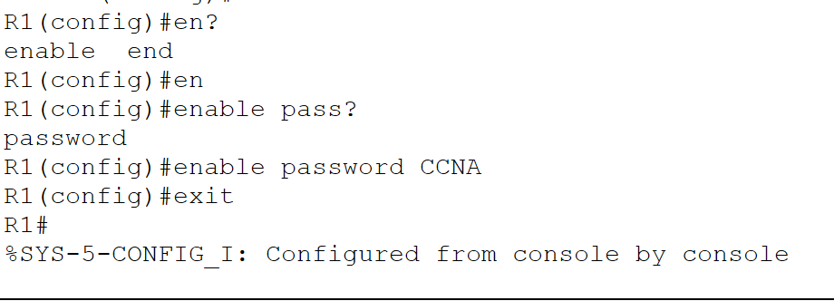

---

# 11. Testing the Enable Password

Exit back toward User EXEC:

```text
exit
```

or:

```text
end
```

Then:

```text
disable
```

The prompt should become:

```text
R1>
```

Now type:

```text
enable
```

The router asks for the password.

Enter:

```text
CCNA
```

If correct:

```text
R1#
```

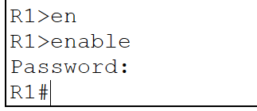

---

## Wrong Password

If the wrong password is entered repeatedly, Cisco IOS can reject the attempt with:

```text
% Bad secrets
```

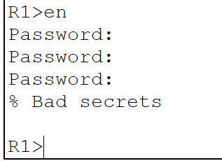

### Troubleshooting checklist

If the password does not work, check:

- Caps Lock
- Uppercase/lowercase characters
- Spelling
- Whether the correct device is being configured
- Whether another authentication method has priority

---

# 12. Step 4 — Verify the Running Configuration

From Privileged EXEC:

```text
show running-config
```

Shortcut:

```text
show run
```

The running configuration contains the current active configuration.

Initially, the password may appear in clear text:

```text
enable password CCNA
```

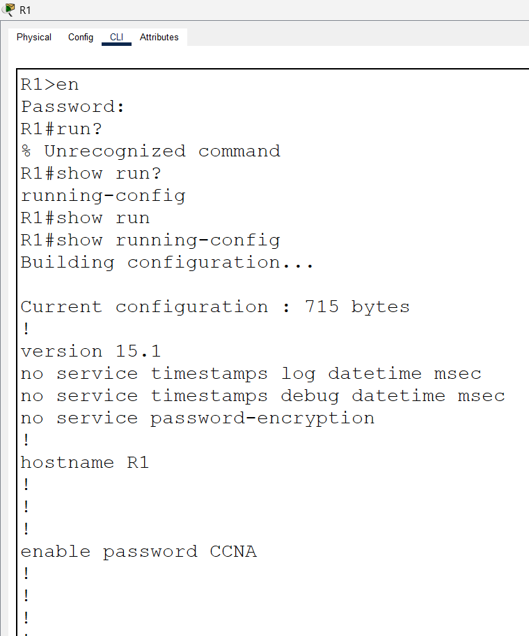

> **Security lesson:** Storing passwords in clear text is undesirable.

---

# 13. Running-Config vs Startup-Config

Cisco IOS commonly uses two important configuration files.

## Running Configuration

```text
running-config
```

Contains the configuration currently active in RAM.

View it with:

```text
show running-config
```

Shortcut:

```text
show run
```

Changes made during the current session immediately affect the running configuration.

---

## Startup Configuration

```text
startup-config
```

Contains the configuration saved for use after a reload/reboot.

View it with:

```text
show startup-config
```

The startup configuration is stored in **NVRAM** on traditional Cisco IOS platforms.

---

## The key difference

```text
Running-config
     |
     |  save
     v
Startup-config
     |
     |  reload
     v
Device configuration after boot
```

### Memory rule

> **Running = current**
>
> **Startup = saved**

If the running configuration is not saved, changes can be lost after a reload.

---

# 14. Step 5 — Enable `service password-encryption`

Enter Global Configuration mode:

```text
configure terminal
```

Then:

```text
service password-encryption
```

This causes applicable plain-text passwords in the configuration to be obfuscated.

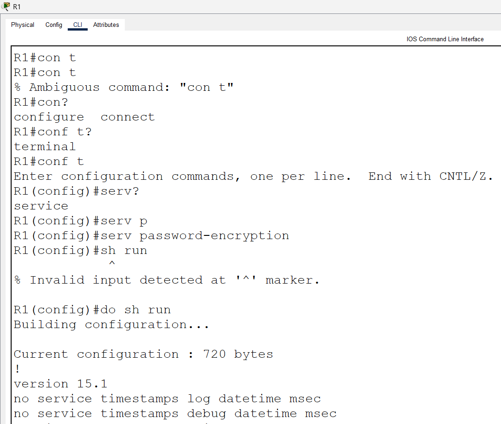

---

# 15. Type 7 Password Obfuscation

After enabling:

```text
service password-encryption
```

check:

```text
show running-config
```

The enable password may now appear similar to:

```text
enable password 7 08026F6028
```

The number:

```text
7
```

identifies the Cisco Type 7 password format.

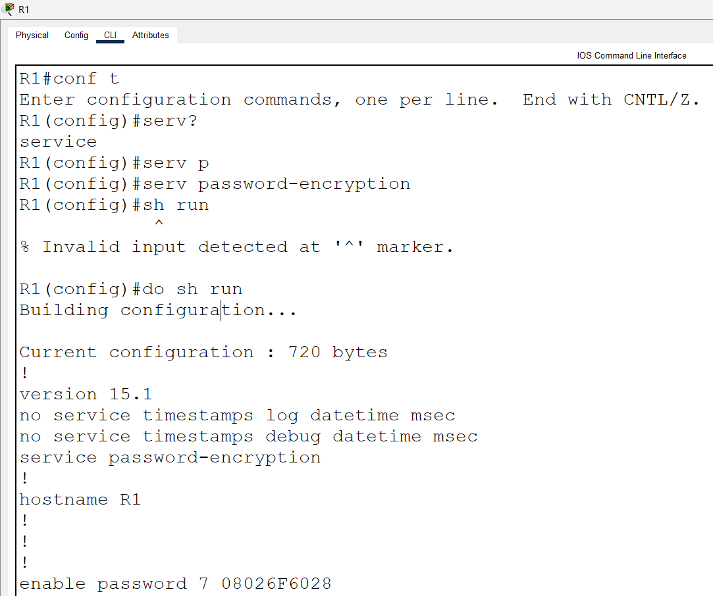

---

## Important Security Note

Type 7 is **not strong modern cryptographic protection**.

It is better than displaying the password in plain text, but it should not be considered strong password security.

### Remember

```text
enable password
        |
        +-- Plain text by default
        |
        +-- Type 7 when service password-encryption is enabled
```

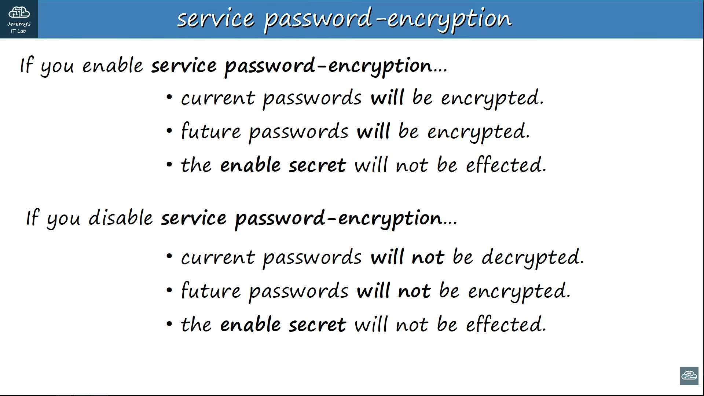

---

# 16. Using `do` from Configuration Mode

Some `show` commands belong to Privileged EXEC mode.

However, Cisco IOS allows many EXEC commands to be run from configuration mode using:

```text
do
```

Example:

```text
R1(config)# do show running-config
```

Shortcut:

```text
R1(config)# do sh run
```

This is useful because I do not have to leave Global Configuration mode just to verify something.

---

# 17. Step 6 — Configure `enable secret`

The preferred method for protecting Privileged EXEC access is:

```text
enable secret <password>
```

Example:

```text
enable secret Cisco
```

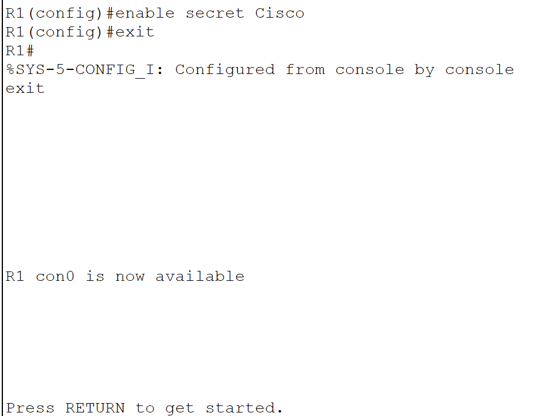

### Example

```text
R1(config)# enable secret Cisco
```

This creates an encrypted secret used to authenticate access to Privileged EXEC mode.

---

# 18. `enable password` vs `enable secret`

| Feature | `enable password` | `enable secret` |
|---|---|---|
| Default storage | Plain text | Encrypted/hashed |
| `service password-encryption` affects it | Yes | Not required |
| Security | Weak | Stronger |
| Priority when both exist | Lower | Higher |
| Recommended | No | Yes |

---

# 19. Enable Secret Takes Priority

If both are configured:

```text
enable password CCNA
enable secret Cisco
```

then:

```text
enable secret
```

takes priority.

Therefore, entering:

```text
CCNA
```

will not authenticate to Privileged EXEC when the secret is configured.

The correct secret:

```text
Cisco
```

must be entered.

### Important rule

> **When both `enable password` and `enable secret` exist, `enable secret` wins.**

This is one of the most important Day 04 facts to remember.

---

# 20. Step 7 — Verify Type 5 Enable Secret

Use:

```text
show running-config
```

or:

```text
do show running-config
```

You may see:

```text
enable password 7 <encrypted-value>
enable secret 5 <hash>
```

The `5` indicates the traditional Cisco Type 5 format.

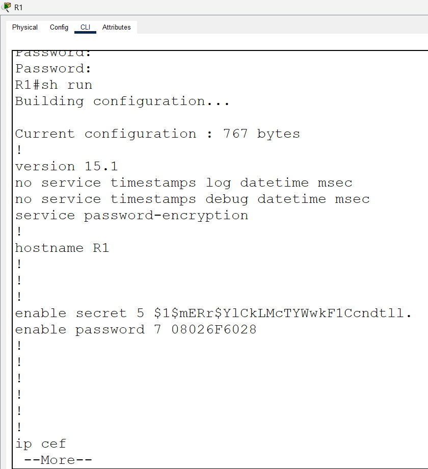

### Study note

For the CCNA-level concept:

```text
Type 7 → weak reversible obfuscation
Type 5 → MD5-based password hash
```

> **Modern security note:** Type 5/MD5 is legacy technology and should not be treated as modern strong password hashing. The important Day 04 exam concept is that `enable secret` is more secure than `enable password` and takes precedence.

---

# 21. `service password-encryption` vs `enable secret`

These commands solve different problems.

## `service password-encryption`

```text
service password-encryption
```

Protects applicable plain-text passwords in the configuration using Cisco Type 7 obfuscation.

## `enable secret`

```text
enable secret <password>
```

Creates a protected secret for Privileged EXEC access.

### Key rule

`enable secret` is protected independently of whether:

```text
service password-encryption
```

is enabled.

---

# 22. Step 8 — The `no` Command

Cisco IOS commonly removes a configuration command by putting:

```text
no
```

before the command.

Example:

```text
no service password-encryption
```

This disables the service for future applicable password entries.

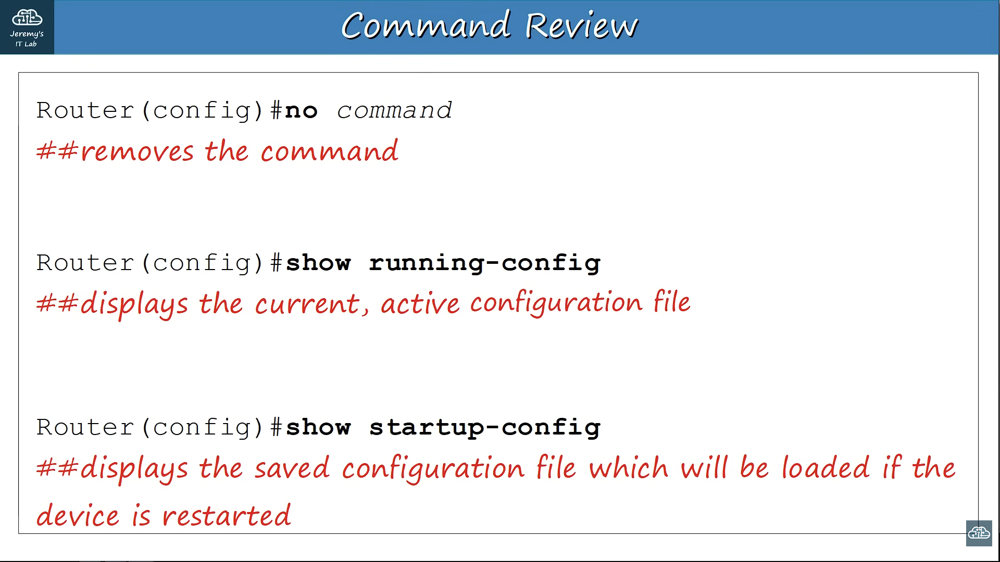

---

## Important Behavior

Disabling:

```text
service password-encryption
```

does **not necessarily restore already-obfuscated passwords to plain text**.

It mainly changes how future applicable passwords are handled.

The `enable secret` remains protected regardless.

---

# 23. Useful `show` Commands

## Show current configuration

```text
show running-config
```

Shortcut:

```text
show run
```

## Show saved configuration

```text
show startup-config
```

## Run a show command from configuration mode

```text
do show running-config
```

or:

```text
do sh run
```

---

# 24. Step 9 — Save the Configuration

Configuration changes made to the running configuration are not automatically permanent.

Save them to startup-config.

### Method 1

```text
write
```

### Method 2

```text
write memory
```

### Method 3 — Preferred/common full command

```text
copy running-config startup-config
```

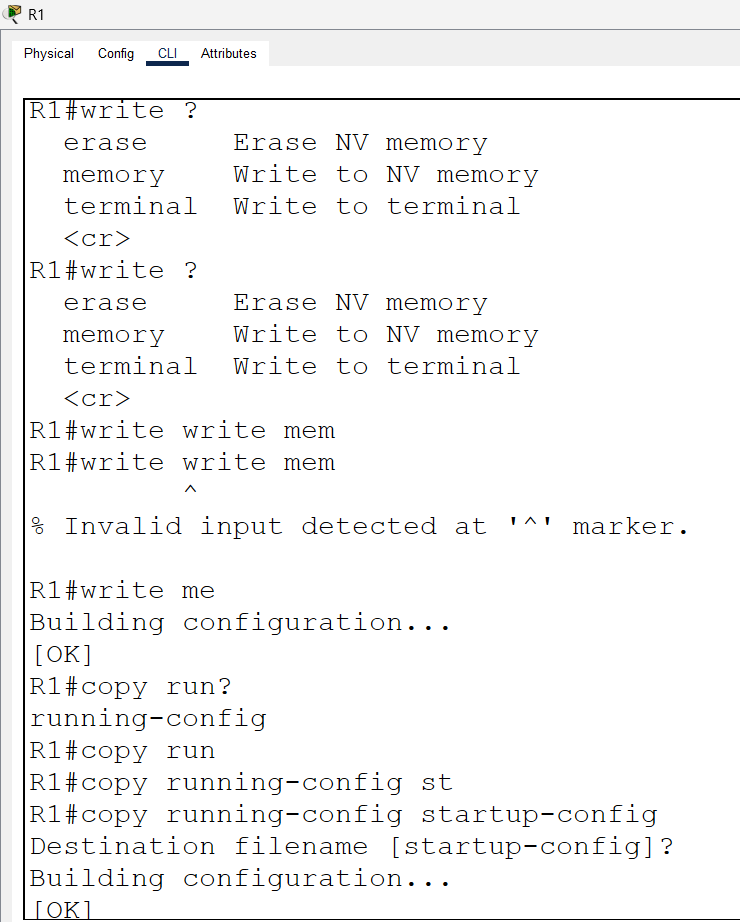

---

## What happens when saving?

Conceptually:

```text
RAM
 |
 | running-config
 |
 | copy
 v
NVRAM
 |
 | startup-config
 v
Available after reload
```

---

# 25. Step 10 — Verify Startup Configuration

Use:

```text
show startup-config
```

This verifies that the configuration has been saved.

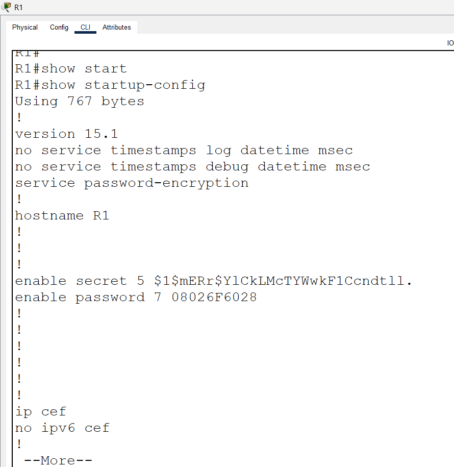

---

# 26. Complete Day 04 Configuration Workflow

This is the sequence I should practice until it becomes automatic.

```text
enable
configure terminal

hostname R1

enable password CCNA
service password-encryption
enable secret Cisco

end

show running-config

copy running-config startup-config

show startup-config
```

### Compact version

```text
en
conf t
hostname R1
enable password CCNA
service password-encryption
enable secret Cisco
end
show run
copy run start
show start
```

> Learn the full commands first. Use shortcuts after understanding them.

---

# 27. Recommended Repetition Drill

Repeat the lab from scratch several times.

## Round 1 — Follow the notes

Use the full commands.

## Round 2 — Use CLI help

Use:

```text
?
```

to discover command options.

## Round 3 — Use shortcuts

Practice:

```text
en
conf t
sh run
do sh run
copy run start
```

## Round 4 — Rebuild without looking

Try to configure:

```text
hostname
enable password
service password-encryption
enable secret
```

without referring to the notes.

## Round 5 — Explain every command

For each command, explain:

- What mode am I in?
- What does the command do?
- Where is the configuration stored?
- Does it affect security?
- Does it survive a reload?

---

# 28. Command Reference

| Command | Purpose | Mode |
|---|---|---|
| `enable` | Enter Privileged EXEC | User EXEC |
| `disable` | Return to User EXEC | Privileged EXEC |
| `configure terminal` | Enter Global Configuration | Privileged EXEC |
| `conf t` | Shortcut for `configure terminal` | Privileged EXEC |
| `hostname R1` | Change device hostname | Global Config |
| `enable password CCNA` | Configure enable password | Global Config |
| `service password-encryption` | Obfuscate applicable passwords | Global Config |
| `enable secret Cisco` | Configure protected enable secret | Global Config |
| `no <command>` | Remove/disable configuration | Depends on command |
| `show running-config` | View active configuration | Privileged EXEC |
| `show run` | Shortcut | Privileged EXEC |
| `do show run` | Run show command from config mode | Config modes |
| `show startup-config` | View saved configuration | Privileged EXEC |
| `write` | Save running-config | Privileged EXEC |
| `write memory` | Save running-config | Privileged EXEC |
| `copy running-config startup-config` | Save running-config | Privileged EXEC |

---

# 29. Mode Transition Cheat Sheet

```text
User EXEC
   |
   | enable
   v
Privileged EXEC
   |
   | configure terminal
   v
Global Configuration
```

Return:

```text
Global Configuration
   |
   | end
   v
Privileged EXEC
   |
   | disable
   v
User EXEC
```

Another option from configuration mode:

```text
exit
```

moves back one configuration level.

---

# 30. Security Concepts to Remember

## `enable password`

```text
enable password CCNA
```

- Older/basic method
- Plain text by default
- Can be affected by `service password-encryption`
- Weak security

## `service password-encryption`

```text
service password-encryption
```

- Obfuscates applicable passwords
- Uses Cisco Type 7
- Better than plain text
- Not strong modern encryption

## `enable secret`

```text
enable secret Cisco
```

- Preferred over `enable password`
- Stored in protected form
- Takes precedence over `enable password`
- Does not depend on `service password-encryption`

---

# 31. Running vs Startup Configuration — Exam Memory

### Running-config

Think:

> **What is happening right now?**

Stored in RAM.

```text
show running-config
```

### Startup-config

Think:

> **What will the device load after restart?**

Stored in NVRAM.

```text
show startup-config
```

### Save

```text
copy running-config startup-config
```

### Golden rule

> **If I change the running configuration and do not save it, a reload can remove those changes.**

---

# 32. Common Mistakes

## Mistake 1 — Forgetting the mode

Example:

```text
Router> hostname R1
```

This is incorrect because `hostname` is a Global Configuration command.

Correct:

```text
Router> enable
Router# configure terminal
Router(config)# hostname R1
```

---

## Mistake 2 — Confusing `>` and `#`

```text
R1>   = User EXEC
R1#   = Privileged EXEC
```

---

## Mistake 3 — Assuming Type 7 is strong encryption

It is not.

```text
Type 7 = weak obfuscation
```

---

## Mistake 4 — Forgetting `enable secret` priority

If both exist:

```text
enable password CCNA
enable secret Cisco
```

the secret takes precedence.

---

## Mistake 5 — Forgetting to save

A successful configuration does not automatically mean it is permanent.

Always verify:

```text
copy running-config startup-config
```

then:

```text
show startup-config
```

---

# 33. Quiz Review

## Quiz 1 — Console Cable

**Question:** Which cable is used to connect to the RJ45 console port?

**Answer:**

> A Cisco rollover/console cable.

A crossover Ethernet cable is not used for RJ45 console access.

A USB cable can also provide console access when connected to a device's USB console port.

---

## Quiz 2 — Password Not Accepted

Possible issue:

> Passwords are case-sensitive.

Check:

- Caps Lock
- Spelling
- Correct password
- Correct device
- Whether `enable secret` is configured

`service password-encryption` being enabled or disabled does not determine whether the typed password is correct.

---

## Quiz 3 — Most Secure Privileged EXEC Method

**Answer:**

```text
enable secret
```

It is preferred over:

```text
enable password
```

---

## Quiz 4 — Both Passwords Configured

If both exist:

```text
enable password CCNA
enable secret Cisco
```

the secret takes precedence.

The user must authenticate with the `enable secret`.

---

## Quiz 5 — Global Configuration Command

Full command:

```text
configure terminal
```

Shortcut:

```text
conf t
```

For learning and exams, know the full command.

---

# 34. My Day 04 Lab Evidence

## My Packet Tracer Work

The following screenshots document my own Day 04 practice.

### Lab Instructions


### Router Hostname / CLI Practice


### Switch Hostname


### Enable Password


### Password Prompt


### Failed Authentication


### Clear-text Password


### Service Password Encryption


### Type 7 Password


### Enable Secret


### Type 5 Enable Secret


### Saving Configuration


### Startup Configuration


---

# 35. Reference Images

### User vs Privileged EXEC


### IOS Modes


### Service Password Encryption


### Command Review — Navigation and Passwords

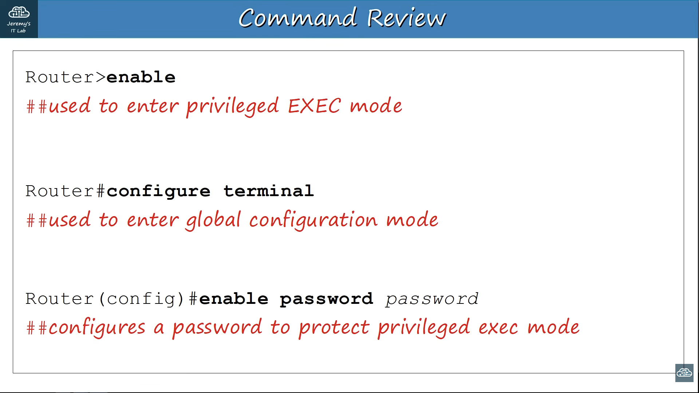

### Encryption and Enable Secret

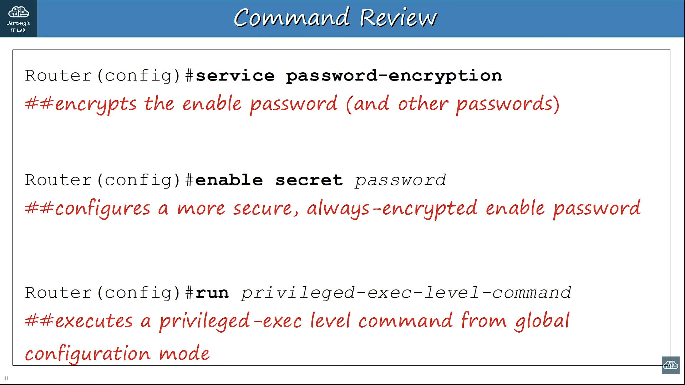

### `no` and Configuration Commands


### Saving Configuration

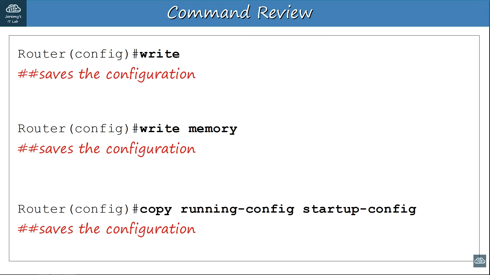

### Rollover Cable


---

# 36. Lab File

Packet Tracer lab:

```text
Day 04 Lab - Basic Device Security.pkt
```

Expected location:

```text
./Day 04 Lab - Basic Device Security.pkt
```

---

# 37. Day 04 Personal Learning Checklist

- [ ] I understand User EXEC mode.
- [ ] I understand Privileged EXEC mode.
- [ ] I understand Global Configuration mode.
- [ ] I can identify `>`, `#`, and `(config)#`.
- [ ] I can use `enable`.
- [ ] I can use `configure terminal`.
- [ ] I can configure a hostname.
- [ ] I understand `enable password`.
- [ ] I understand `service password-encryption`.
- [ ] I know what Type 7 means.
- [ ] I can configure `enable secret`.
- [ ] I understand why `enable secret` takes precedence.
- [ ] I can use `show running-config`.
- [ ] I can use `show startup-config`.
- [ ] I understand RAM vs NVRAM configuration storage.
- [ ] I can save the configuration.
- [ ] I can explain `write`, `write memory`, and `copy running-config startup-config`.
- [ ] I can use `?` for context-sensitive help.
- [ ] I can use Tab completion.
- [ ] I can use `do show run` from configuration mode.
- [ ] I can rebuild the lab without looking at the notes.

---

# 38. My Day 04 Command Drill

Practice typing this from memory:

```text
enable
configure terminal
hostname R1
enable password CCNA
service password-encryption
enable secret Cisco
end
show running-config
copy running-config startup-config
show startup-config
```

Then repeat the same exercise on the switch:

```text
enable
configure terminal
hostname SW1
enable password CCNA
service password-encryption
enable secret Cisco
end
show running-config
copy running-config startup-config
show startup-config
```

---

# 39. What I Should Be Able to Explain Without Notes

By the end of Day 04, I should be able to answer these from memory:

1. What is Cisco IOS?
2. What is a CLI?
3. What is User EXEC mode?
4. What is Privileged EXEC mode?
5. What is Global Configuration mode?
6. What does `enable` do?
7. What does `configure terminal` do?
8. What is the difference between `enable password` and `enable secret`?
9. What does `service password-encryption` do?
10. What does Type 7 mean?
11. Why is Type 7 considered weak?
12. Which password takes priority when both are configured?
13. What is `running-config`?
14. What is `startup-config`?
15. Where is startup-config traditionally stored?
16. How do I save the running configuration?
17. What happens if I reload without saving?
18. How do I view the current configuration?
19. How do I view the saved configuration?
20. How do I run a `show` command while staying in configuration mode?

---

# 40. Day 04 Takeaways

### Core CLI flow

```text
Router>
   |
   | enable
   v
Router#
   |
   | configure terminal
   v
Router(config)#
```

### Core security hierarchy

```text
enable password
      ↓
plain text by default
      ↓
service password-encryption
      ↓
Type 7 obfuscation

enable secret
      ↓
protected secret
      ↓
takes priority over enable password
```

### Core configuration lifecycle

```text
Configure
   ↓
Running-config
   ↓
Verify
   ↓
Copy to startup-config
   ↓
NVRAM
   ↓
Survives reload
```

---

# 41. Personal Notes

## What I Learned Today

- 

## Commands I Need to Memorize

- 

## Commands I Still Forget

- 

## Mistakes I Made

- 

## Troubleshooting Lessons

- 

## What I Can Now Do Without Help

- 

## What I Need to Practice Again

- 

## Day 04 Confidence

**CLI navigation:** ☐ Low ☐ Medium ☐ High

**Basic device configuration:** ☐ Low ☐ Medium ☐ High

**Password/security configuration:** ☐ Low ☐ Medium ☐ High

**Configuration verification:** ☐ Low ☐ Medium ☐ High

**Saving configuration:** ☐ Low ☐ Medium ☐ High

---

# 42. Day 04 Completion

**Status:** ☐ Completed

**Lab:** `Day 04 Lab - Basic Device Security.pkt`

**Primary skills:**

- Cisco IOS CLI
- IOS modes
- Hostname configuration
- Privileged EXEC security
- Password encryption
- Enable secret
- Running vs startup configuration
- NVRAM persistence
- Configuration verification
- Cisco CLI help and shortcuts

> **Journey principle:** Repetition matters. The goal is not just to recognize commands in a video, but to type them repeatedly until the CLI workflow becomes automatic.
