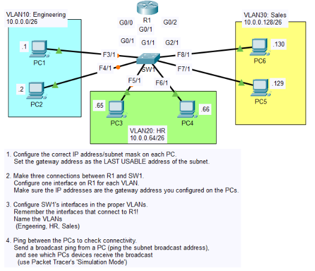

# Day 15 — VLANs and Inter-VLAN Routing

## Overview

Day 15 focused on **VLANs (Virtual Local Area Networks)**, **broadcast domains**, **access ports**, and **Inter-VLAN Routing** using Cisco Packet Tracer.

In this lab, one switch (SW1) was divided into three logical VLANs:

- **VLAN 10 — Engineering**
- **VLAN 20 — HR**
- **VLAN 30 — Sales**

A router (R1) was connected to the switch using three physical interfaces. Each router interface acted as the default gateway for one VLAN.

The lab also included connectivity testing and Packet Tracer Simulation Mode to observe how traffic travels between VLANs.

---

## Learning Objectives

By the end of this lab, I practiced:

- Understanding LANs and broadcast domains
- Understanding VLANs and Layer 2 segmentation
- Creating VLANs on a Cisco switch
- Naming VLANs
- Configuring switch interfaces as access ports
- Assigning access ports to VLANs
- Configuring router interfaces as VLAN gateways
- Configuring static IPv4 addresses on PCs
- Using `/26` subnet masks
- Testing connectivity between VLANs
- Testing a subnet broadcast address
- Verifying VLAN assignments with `show vlan brief`
- Verifying router interfaces with `show ip interface brief`
- Observing packet movement using Packet Tracer Simulation Mode

---

# 1. VLAN Fundamentals

## What is a VLAN?

**VLAN** stands for **Virtual Local Area Network**.

A VLAN allows a physical switch network to be logically divided into separate Layer 2 networks.

For example, the same physical switch can contain:

```text
SW1
├── VLAN 10 → Engineering
├── VLAN 20 → HR
└── VLAN 30 → Sales
```

Devices in different VLANs are separated into different **broadcast domains**.

---

## What is a Broadcast Domain?

A broadcast domain is a group of devices that can receive a Layer 2 broadcast frame.

Without VLAN segmentation, devices connected to the same Layer 2 network can belong to the same broadcast domain.

VLANs allow us to split that network into multiple broadcast domains.

```text
              SW1
        ┌──────┼──────┐
        │      │      │
     VLAN 10 VLAN 20 VLAN 30
     Eng.     HR      Sales
        │      │      │
   Broadcast Broadcast Broadcast
      Domain   Domain   Domain
```

### Important

A broadcast from VLAN 10 does **not** automatically reach VLAN 20 or VLAN 30.

To communicate between different VLANs, traffic must be routed at Layer 3.

---

# 2. Lab Topology

The topology contains:

- 1 Router — R1
- 1 Switch — SW1
- 6 PCs
- 3 VLANs

```text
                         R1
                  ┌──────┼──────┐
                  │      │      │
                G0/0   G0/1   G0/2
                  │      │      │
                  └──────┼──────┘
                         SW1
              ┌──────────┼──────────┐
              │          │          │
           VLAN 10    VLAN 20    VLAN 30
        Engineering      HR        Sales
          PC1 PC2      PC3 PC4    PC5 PC6
```

The router provides Layer 3 connectivity between the three VLANs.

---

# 3. IP Addressing Plan

All three VLANs use a `/26` subnet mask:

```text
Subnet Mask: 255.255.255.192
Prefix: /26
```

A `/26` subnet provides:

- 64 total addresses
- 62 usable host addresses
- 1 network address
- 1 broadcast address

## VLAN 10 — Engineering

```text
Network:        10.0.0.0/26
Network Address: 10.0.0.0
Usable Range:    10.0.0.1 - 10.0.0.62
Broadcast:       10.0.0.63
Gateway:         10.0.0.62
```

| Device | IP Address | Mask | Gateway |
|---|---|---|---|
| PC1 | 10.0.0.1 | 255.255.255.192 | 10.0.0.62 |
| PC2 | 10.0.0.2 | 255.255.255.192 | 10.0.0.62 |

---

## VLAN 20 — HR

```text
Network:        10.0.0.64/26
Network Address: 10.0.0.64
Usable Range:    10.0.0.65 - 10.0.0.126
Broadcast:       10.0.0.127
Gateway:         10.0.0.126
```

| Device | IP Address | Mask | Gateway |
|---|---|---|---|
| PC3 | 10.0.0.65 | 255.255.255.192 | 10.0.0.126 |
| PC4 | 10.0.0.66 | 255.255.255.192 | 10.0.0.126 |

---

## VLAN 30 — Sales

```text
Network:        10.0.0.128/26
Network Address: 10.0.0.128
Usable Range:    10.0.0.129 - 10.0.0.190
Broadcast:       10.0.0.191
Gateway:         10.0.0.190
```

| Device | IP Address | Mask | Gateway |
|---|---|---|---|
| PC5 | 10.0.0.129 | 255.255.255.192 | 10.0.0.190 |
| PC6 | 10.0.0.130 | 255.255.255.192 | 10.0.0.190 |

---

# 4. Why the Gateway Uses the Last Usable Address

Each subnet has a network address, usable host addresses, and a broadcast address.

For example:

```text
10.0.0.0/26

10.0.0.0     → Network
10.0.0.1     → First usable
...
10.0.0.62    → Last usable
10.0.0.63    → Broadcast
```

The lab uses the **last usable address** as the default gateway:

```text
VLAN 10 → 10.0.0.62
VLAN 20 → 10.0.0.126
VLAN 30 → 10.0.0.190
```

The default gateway is the Layer 3 device that a PC uses when it needs to communicate with a different IP network.

---

# 5. PC Configuration

Each PC was configured with:

- Static IPv4 address
- Subnet mask
- Default gateway

## PC1

```text
IP Address:     10.0.0.1
Subnet Mask:    255.255.255.192
Default Gateway: 10.0.0.62
```

## PC2

```text
IP Address:     10.0.0.2
Subnet Mask:    255.255.255.192
Default Gateway: 10.0.0.62
```

## PC3

```text
IP Address:     10.0.0.65
Subnet Mask:    255.255.255.192
Default Gateway: 10.0.0.126
```

## PC4

```text
IP Address:     10.0.0.66
Subnet Mask:    255.255.255.192
Default Gateway: 10.0.0.126
```

## PC5

```text
IP Address:     10.0.0.129
Subnet Mask:    255.255.255.192
Default Gateway: 10.0.0.190
```

## PC6

```text
IP Address:     10.0.0.130
Subnet Mask:    255.255.255.192
Default Gateway: 10.0.0.190
```

---

# 6. Router Configuration

R1 has three physical interfaces.

Each interface belongs to a different IP subnet.

| Router Interface | VLAN | IP Address | Subnet Mask |
|---|---:|---|---|
| G0/0 | VLAN 10 | 10.0.0.62 | 255.255.255.192 |
| G0/1 | VLAN 20 | 10.0.0.126 | 255.255.255.192 |
| G0/2 | VLAN 30 | 10.0.0.190 | 255.255.255.192 |

---

## Configure G0/0 — VLAN 10

```cisco
enable
configure terminal

interface g0/0
ip address 10.0.0.62 255.255.255.192
no shutdown
```

---

## Configure G0/1 — VLAN 20

```cisco
interface g0/1
ip address 10.0.0.126 255.255.255.192
no shutdown
```

---

## Configure G0/2 — VLAN 30

```cisco
interface g0/2
ip address 10.0.0.190 255.255.255.192
no shutdown
```

---

# 7. Verify Router Interfaces

Use:

```cisco
do show ip interface brief
```

Expected result:

```text
Interface              IP-Address      Status    Protocol
GigabitEthernet0/0     10.0.0.62       up        up
GigabitEthernet0/1     10.0.0.126      up        up
GigabitEthernet0/2     10.0.0.190      up        up
Vlan1                  unassigned      down      down
```

The important part is that the three router interfaces are:

```text
up / up
```

This confirms that the interfaces are operational.

---

# 8. Switch VLAN Configuration

SW1 is configured with three VLANs.

```text
VLAN 10 → Engineering
VLAN 20 → HR
VLAN 30 → Sales
```

---

## Create VLAN 10

```cisco
enable
configure terminal

vlan 10
name Engineering
```

---

## Create VLAN 20

```cisco
vlan 20
name HR
```

---

## Create VLAN 30

```cisco
vlan 30
name Sales
```

---

# 9. Configure Access Ports

An **access port** is a switch port assigned to a single VLAN.

In this lab, the switch interfaces connected to the PCs and router were configured as access ports.

---

## VLAN 10 — Engineering

Interfaces:

```text
G0/1
F3/1
F4/1
```

Configuration:

```cisco
interface range g0/1,f3/1,f4/1
switchport mode access
switchport access vlan 10
```

---

## VLAN 20 — HR

Interfaces:

```text
G1/1
F5/1
F6/1
```

Configuration:

```cisco
interface range g1/1,f5/1,f6/1
switchport mode access
switchport access vlan 20
```

---

## VLAN 30 — Sales

Interfaces:

```text
G2/1
F7/1
F8/1
```

Configuration:

```cisco
interface range g2/1,f7/1,f8/1
switchport mode access
switchport access vlan 30
```

---

# 10. VLAN Port Mapping

The final port assignment is:

| VLAN | Name | Ports |
|---:|---|---|
| 10 | Engineering | G0/1, F3/1, F4/1 |
| 20 | HR | G1/1, F5/1, F6/1 |
| 30 | Sales | G2/1, F7/1, F8/1 |

This means:

```text
VLAN 10
├── G0/1
├── F3/1 → PC1
└── F4/1 → PC2

VLAN 20
├── G1/1
├── F5/1 → PC3
└── F6/1 → PC4

VLAN 30
├── G2/1
├── F7/1 → PC5
└── F8/1 → PC6
```

---

# 11. Verify VLANs

Use:

```cisco
do show vlan brief
```

The important output should show:

```text
10  Engineering   active   Gig0/1, Fa3/1, Fa4/1
20  HR            active   Gig1/1, Fa5/1, Fa6/1
30  Sales         active   Gig2/1, Fa7/1, Fa8/1
```

This verifies:

1. The VLANs exist.
2. The VLAN names are correct.
3. The expected ports belong to each VLAN.
4. The VLANs are active.

---

# 12. Access Port vs VLAN

These concepts are related but not identical.

### Access Port

A switch port configured as:

```cisco
switchport mode access
```

is an access port.

### Access VLAN

The VLAN assigned to the access port is configured with:

```cisco
switchport access vlan 10
```

For example:

```cisco
interface f3/1
switchport mode access
switchport access vlan 10
```

This means:

```text
F3/1 → Access Port → VLAN 10
```

---

# 13. Inter-VLAN Routing

Devices in the same VLAN can communicate at Layer 2 through the switch.

Example:

```text
PC1 → PC2
```

Both are in VLAN 10.

But PC1 and PC3 belong to different networks:

```text
PC1 → VLAN 10 → 10.0.0.0/26
PC3 → VLAN 20 → 10.0.0.64/26
```

The switch cannot perform the Layer 3 routing between these networks.

R1 performs the routing.

```text
PC1
 │
 │ VLAN 10
 ▼
SW1
 │
 │
 ▼
R1 G0/0
10.0.0.62
 │
 │ routing
 ▼
R1 G0/1
10.0.0.126
 │
 │ VLAN 20
 ▼
SW1
 │
 ▼
PC3
```

This is **Inter-VLAN Routing**.

---

# 14. How PC1 Reaches PC3

PC1:

```text
10.0.0.1/26
Gateway: 10.0.0.62
```

PC3:

```text
10.0.0.65/26
Gateway: 10.0.0.126
```

PC1 determines that `10.0.0.65` is outside its local subnet.

Therefore, PC1 sends the traffic toward its default gateway:

```text
PC1
10.0.0.1
   ↓
Default Gateway
10.0.0.62
   ↓
R1
   ↓
10.0.0.126
   ↓
SW1
   ↓
PC3
10.0.0.65
```

Packet Tracer Simulation Mode was used to observe this packet movement.

---

# 15. Inter-VLAN Connectivity Testing

From PC1:

```text
PC1 → PC3
```

Test:

```text
ping 10.0.0.65
```

The ping successfully reached PC3 after the configuration was completed.

---

## PC1 → PC5

PC5 belongs to VLAN 30:

```text
PC5 = 10.0.0.129
```

Test:

```text
ping 10.0.0.129
```

This also demonstrated Inter-VLAN connectivity through R1.

---

# 16. Why the First Ping Can Time Out

During the testing, the first ping can show:

```text
Request timed out.
Reply from ...
Reply from ...
Reply from ...
```

For example:

```text
Packets: Sent = 4, Received = 3, Lost = 1
```

This does not necessarily mean the configuration is incorrect.

The first packet can be affected by initial address-resolution activity before subsequent packets succeed.

The important verification is whether connectivity becomes successful on subsequent attempts.

A later test showed:

```text
Packets: Sent = 4
Received = 4
Lost = 0
```

which confirms successful connectivity.

---

# 17. Broadcast Address Testing

VLAN 10 uses:

```text
10.0.0.0/26
```

Therefore:

```text
Network:   10.0.0.0
Broadcast: 10.0.0.63
```

A test was performed from PC1:

```text
ping 10.0.0.63
```

The simulation demonstrated that the broadcast traffic remained within the VLAN 10 broadcast domain.

The traffic reached devices belonging to VLAN 10, rather than being forwarded as a Layer 2 broadcast into VLAN 20 or VLAN 30.

---

# 18. Broadcast Domain Isolation

The three VLANs create three separate broadcast domains.

```text
             SW1
              │
      ┌───────┼────────┐
      │       │        │
   VLAN 10  VLAN 20  VLAN 30
     │        │        │
 Broadcast Broadcast Broadcast
  Domain     Domain    Domain
```

Therefore:

```text
VLAN 10 broadcast
      ↓
VLAN 10 only

VLAN 20 broadcast
      ↓
VLAN 20 only

VLAN 30 broadcast
      ↓
VLAN 30 only
```

A router does not simply forward a Layer 2 broadcast from one VLAN into another VLAN.

---

# 19. Packet Flow in Simulation Mode

The simulation helped visualize two different types of traffic.

## Inter-VLAN Unicast

Example:

```text
PC1 → PC3
```

Traffic path:

```text
PC1
 ↓
SW1
 ↓
R1
 ↓
SW1
 ↓
PC3
```

The router performs Layer 3 forwarding between the different IP networks.

---

## VLAN 10 Broadcast

Example:

```text
PC1 → 10.0.0.63
```

Traffic remains within the VLAN 10 broadcast domain.

Conceptually:

```text
PC1
 ↓
SW1
 ├── PC2
 └── R1 interface for VLAN 10
```

It does not become a Layer 2 broadcast throughout VLAN 20 or VLAN 30.

---

# 20. Troubleshooting During the Lab

A few CLI syntax mistakes occurred during configuration.

## Mistake 1 — Incomplete `ip address` command

Initially:

```cisco
ip address 10.0.0.62
```

Result:

```text
% Incomplete command.
```

### Correct command

The subnet mask must also be provided:

```cisco
ip address 10.0.0.62 255.255.255.192
```

---

## Mistake 2 — Incorrect `no shutdown` spelling

An incorrect command was entered:

```cisco
not shutdown
```

IOS rejected it.

### Correct command

```cisco
no shutdown
```

This enables the interface administratively.

---

## Mistake 3 — Incorrect `switchport` syntax

An incorrect command was entered:

```cisco
switch port mode access
```

The Cisco IOS command is:

```cisco
switchport mode access
```

Notice that `switchport` is one word.

---

## Mistake 4 — VLAN does not exist yet

When assigning a port to VLAN 10, the switch displayed:

```text
% Access VLAN does not exist. Creating VLAN 10
```

The switch created the VLAN automatically in this lab environment.

The VLANs were later explicitly named:

```cisco
vlan 10
name Engineering

vlan 20
name HR

vlan 30
name Sales
```

---

# 21. Useful Verification Commands

## Check Router Interfaces

```cisco
show ip interface brief
```

Useful for checking:

- IP addresses
- Interface status
- Protocol status

---

## Check VLANs and Ports

```cisco
show vlan brief
```

Useful for checking:

- VLAN IDs
- VLAN names
- VLAN status
- Access port assignments

---

## Test Connectivity

From a Packet Tracer PC:

```text
ping <destination-ip>
```

Examples:

```text
ping 10.0.0.65
ping 10.0.0.129
ping 10.0.0.63
```

---

# 22. Key Concepts Learned

### VLAN

A logical Layer 2 network that separates devices on a switch.

### Broadcast Domain

A group of devices that receive the same Layer 2 broadcast traffic.

### Access Port

A switch port assigned to a single VLAN.

### Default Gateway

The Layer 3 address used by a host to reach destinations outside its local subnet.

### Inter-VLAN Routing

Routing traffic between different VLANs using a Layer 3 device such as a router.

### `/26`

A subnet with:

```text
64 total addresses
62 usable host addresses
```

### Router Interface

In this lab, each R1 physical interface provided the default gateway for one VLAN.

---

# 23. Final Configuration Summary

```text
VLAN 10 — Engineering
Network: 10.0.0.0/26
Gateway: 10.0.0.62
PC1:     10.0.0.1
PC2:     10.0.0.2
R1:      G0/0

VLAN 20 — HR
Network: 10.0.0.64/26
Gateway: 10.0.0.126
PC3:     10.0.0.65
PC4:     10.0.0.66
R1:      G0/1

VLAN 30 — Sales
Network: 10.0.0.128/26
Gateway: 10.0.0.190
PC5:     10.0.0.129
PC6:     10.0.0.130
R1:      G0/2
```

---

# 24. Lab Evidence

## Topology



## PC Configuration

- `PC1_Interface_IP_Configuration.png`
- `PC1_Global_Gateway_Configuration.png`
- `PC2_Interface_IP_Configuration.png`
- `PC3_Interface_IP_Configuration.png`
- `PC4_Interface_IP_Configuration.png`
- `PC5_Interface_IP_Configuration.png`
- `PC6_Interface_IP_Configuration.png`

## Router Configuration

- `R1_G0-0_and_G0-1_Interface_Configuration_CLI.png`
- `R1_G0-2_Config_and_Show_IP_Interface_Brief_Verification.png`

## Switch VLAN Configuration

- `SW1_Access_Port_Config_and_VLAN10_Creation.png`
- `SW1_Access_Ports_VLAN20_VLAN30_Config_and_Verification.png`
- `SW1_VLAN_Naming_Engineering_HR_Sales_Verification.png`

## Simulation Videos

- `videos/my-work/Packet_Simulation_PC1_to_PC3_InterVLAN_Ping.mp4`
- `videos/my-work/Packet_Simulation_PC1_VLAN10_Subnet_Broadcast_Ping.mp4`

---

# 25. Final Takeaway

The main idea from this lab is:

```text
VLANs separate Layer 2 networks.
Routers provide Layer 3 communication between those networks.
```

In this lab:

```text
VLAN 10 ──┐
          │
VLAN 20 ──┼── R1 ── Inter-VLAN Routing
          │
VLAN 30 ──┘
```

The practical lab connected several important CCNA concepts:

**Subnetting → VLANs → Broadcast Domains → Access Ports → Default Gateways → Routing → Inter-VLAN Communication → Packet Simulation**

This made the VLAN theory easier to understand by seeing the configuration and packet flow in an actual Packet Tracer topology.
